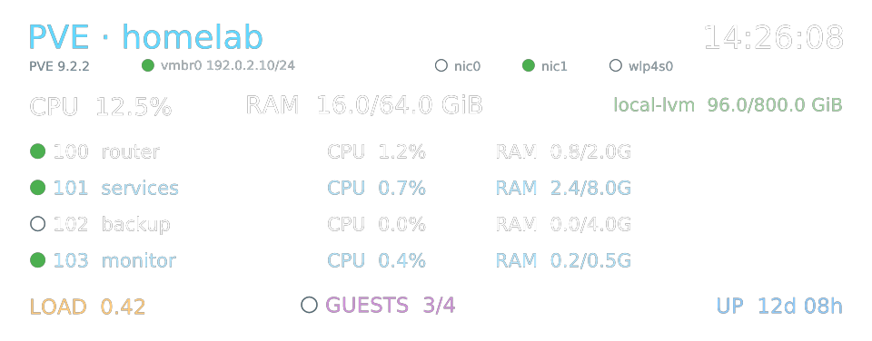

# GEM12+ PVE 状态屏

[简体中文](README.md) | [English](README.en.md)

基于 [zehnm/aoostar-rs](https://github.com/zehnm/aoostar-rs) 的 Linux 屏幕控制工具，面向
AOOSTAR GEM12+ 与 Proxmox VE 场景。它可以在设备的 960×376 副屏上持续展示节点、虚拟机、
存储和网络状态，并使用内置 MAFP 指纹模块的触摸信号控制屏幕。



> 图中地址及工作负载均为文档示例，不对应真实环境。

## 功能

- 单页面展示 PVE 节点、CPU、内存、负载、运行时间、存储与虚拟机状态。
- 每秒刷新一次，并显示 PVE 主机时间。
- 使用绿色实心圆和灰色空心圆显示网络接口及来宾运行状态，同时展示主接口 IP/CIDR。
- 支持 GEM12+ MAFP 指纹模块的触摸事件，无需录入或识别指纹：
  - 息屏时任意触摸唤醒。
  - 持续触摸 2 秒关闭屏幕。
- 提供触摸时序示波器，用于观察按下、松开以及硬件能够识别的最短间隔。
- 提供独立、非特权 LXC 的生产部署配置，包括 USB 自动重绑定和受限 SSH 数据采集。
- 保留 `aoostar-rs` 的图片显示、动态传感器面板、局部刷新和屏幕开关能力。

## 工具

| 程序 | 用途 |
| --- | --- |
| `asterctl` | 控制副屏、渲染图片和动态状态面板，并处理触摸手势 |
| `aster-pve` | 通过 SSH 读取 PVE 节点、虚拟机、存储、网络和主机时间 |
| `aster-sysinfo` | 将 Linux 系统传感器数据输出为 `asterctl` 可读取的文本 |
| `fingerprint-scope` | 在屏幕上以循环时间轴显示触摸模块的按下和松开状态 |
| `fingerprint-touch` | 输出 MAFP 模块的原始触摸事件，便于诊断 |

## 快速开始

从 [Releases](https://github.com/expire5853/gem12-pve-display/releases) 下载 Linux x64 工具包，
或在本地构建：

```shell
cargo build --release --bins --all-features
```

采集一次 PVE 状态并输出到终端：

```shell
aster-pve --host root@pve.example.com --storage local-lvm --console
```

使用模拟串口和脱敏示例数据预览面板，不会访问真实屏幕：

```shell
asterctl \
  --simulate --save \
  --config pve-monitor.json \
  --config-dir cfg \
  --font-dir fonts \
  --sensor-path docs/examples/pve-sensors.txt
```

渲染结果写入 `out/`。实际使用方法见 [PVE 状态面板说明](docs/pve.md)，生产部署见
[独立 LXC 部署指南](deploy/README.md)。

## 通用传感器面板

除 PVE 专用页面外，本项目仍兼容原项目的 AOOSTAR-X 动态面板配置：


共享的 LCD 协议和基础工具可参考原项目的
[用户指南](https://zehnm.github.io/aoostar-rs)。

## 安全提示

屏幕协议来自对 AOOSTAR-X 软件的逆向分析，没有厂商提供的官方协议文档。使用前请了解：

- 软件可能不适用于所有固件版本或硬件批次。
- 异常命令可能导致屏幕固件无响应，需要断电重启。
- 指纹模块在本项目中只作为触摸输入，不读取、录入或匹配指纹。
- 不要同时运行 `fprintd` 或其他占用同一 USB 接口的指纹客户端。

使用本软件所产生的风险由使用者自行承担。

## 参与贡献

欢迎提交 Issue 和 Pull Request。涉及协议或部署方式的较大改动，建议先创建 Issue 讨论。

## 许可证

本项目可任选以下许可证之一使用：

- [Apache License 2.0](LICENSE-APACHE)
- [MIT License](LICENSE-MIT)
